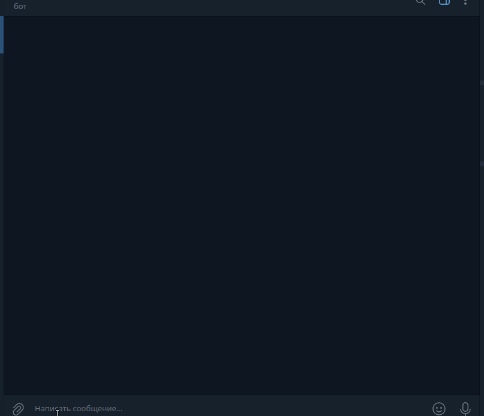

# Telegram cryptocurrency wallet for Solana blockchain

## The cryptocurrency wallet is under development and is not recommended for use

## Installation

```bash
# clone the repository
https://github.com/o5b/telegram-crypto-wallet.git
cd telegram-crypto-wallet/
# install and activate the virtual environment
python3.12 -m venv venv
source venv/bin/activate
# insatll requirements
pip install -r requirements/base.txt
```

## Preparation before Use

Before running, you need to create and populate the .env settings file.

```bash
# create settings file
cp .env.example .env
```

You need to specify your token for accessing the Telegram API and the database engine in it.

- Create a bot via BotFather on Telegram and obtain the token for your bot.
- Make sure that your bot has polling mode enabled for updates.

Example `.env`:

```bash
# Settings for the token and list of administrators for the bot.
# BOT_TOKEN - token for accessing the Telegram API.
BOT_TOKEN='your telegram bot token'

POSTGRES_USER=walletbot
POSTGRES_PASSWORD=walletbot
POSTGRES_DB=walletbot
POSTGRES_HOST=postgres
POSTGRES_PORT=5432

GUNICORN_PORT=8000
GUNICORN_WORKERS=2
GUNICORN_TIMEOUT=60
GUNICORN_LOG_LEVEL=info

DJANGO_SECRET_KEY='your django secure key'
DJANGO_DEBUG=0
# DJANGO_ALLOWED_HOSTS=127.0.0.1,localhost
DJANGO_LANGUAGE_CODE=en-us
DJANGO_TIME_ZONE=UTC
DJANGO_CSRF_TRUSTED_ORIGINS=
DJANGO_EMAIL_HOST=localhost
DJANGO_EMAIL_PORT=25
DJANGO_EMAIL_HOST_USER=
DJANGO_EMAIL_HOST_PASSWORD=
# DJANGO_EMAIL_USE_TLS=false
DJANGO_SERVER_EMAIL=root@localhost
DJANGO_DEFAULT_FROM_EMAIL=webmaster@localhost
DJANGO_ADMIN_NAME=
DJANGO_ADMIN_EMAIL=
DJANGO_SUPERUSER_USERNAME=admin
DJANGO_SUPERUSER_PASSWORD=qwerty123
DJANGO_SUPERUSER_EMAIL=admin@example.com
```

For local run without docker DJANGO DEBUG in True

### If `postgresql` is selected as the database, then you can run it in Docker:

```bash
cd telegram-crypto-wallet/compose/
# start postgresql container:
docker compose -f postgres-docker-compose.yml up -d
# stop:
docker compose -f postgres-docker-compose.yml down -v
```

## Preparation Django

```bash
cd telegram-crypto-wallet/
# if not activated yet, then activate the virtual environment
source venv/bin/activate
python manage.py makemigrations
python manage.py migrate
python manage.py createsuperuser
python manage.py collectstatic
```

### Running Django

```bash
cd telegram-crypto-wallet/
# if not activated yet, then activate the virtual environment
source venv/bin/activate
python -m uvicorn --reload web.settings.asgi:application
```

Now you can login to the admin site: http://127.0.0.1:8000/admin/

### Running a bot

```bash
cd telegram-crypto-wallet/
# if not activated yet, then activate the virtual environment
source venv/bin/activate
python run_bot.py
```

## Run in docker

### Run locally

```bash
cd telegram-crypto-wallet/
# run
docker compose -f docker-compose.yml up -d
# stop
docker compose -f docker-compose.yml down -v
```

Now you can login to the admin site: http://127.0.0.1/admin/

### Run in production

You need to add your website domain to docker-compose-prod.yml

```bash
cd telegram-crypto-wallet/
# run
docker compose -f docker-compose-prod.yml up -d
# stop
docker compose -f docker-compose-prod.yml down -v
```

Now you can login to the admin site: https://your_domain/admin/

The database data will be stored in the parent folder of the project root folder.

## After run, the wallet will be available on Telegram

### Demo

#### Transfer Sol


#### Transfer Spl-token


